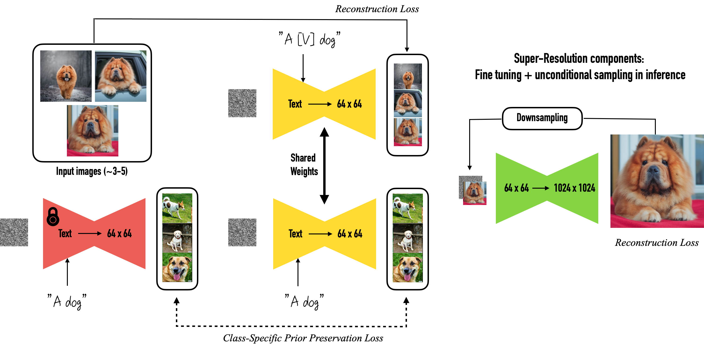

## Обзор статьи

### Введение

На данный момент *text-to-image* модели позволяют генерировать высококачественные и разнообразные изображения по заданному текстовому вводу. Несмотря на прогресс в этой области глубокого обучения, данные модели испытывают трудности с генерацией конкретных объектов в новых контекстах. Это связано с ограниченной "выразительностью" их выходного пространства. Данный недостаток не позволяет использовать *text-to-image* модели в ситуациях, которые требуют персонализированной генерации.

Задачу стоявшую перед авторами статьи можно сформулировать следующим образом: используя небольшой набор эталонных представлений выбранного объекта, необходимо внедрить в *text-to-image* модель знания о данном объекте для последующей генерации изображений, которые будут соответствовать внешнему виду референсных представлений, но не будут привязаны к конкретному контексту.

### Предложенный метод (DreamBooth)

Новаторство данного метода заключается в том, что это первый подход к дообучению *text-to-image* моделей, который является *subject-driven*. Благодаря этому свойству пользователи всего по нескольким референсам заданного объекта, смогут синтезировать новые изображения, которые будут сохранять уникальные черты объекта.

На вход DreamBooth передаются 3-5 изображений заданного объект, обозначение класса объекта и предобученная *text-to-image* модель, на выходе метода -- "персонализированная" модель, в "словарь" которой было добавлено уникальное обозначение для выбранного объекта. Используя на этапе инференса это уникальное обозначение, мы можем получить изображения заданного объекта в различных контекстах.



Процесс дообучения делится на 2 этапа:
1. На первом этапе части модели с низким разрешением параллельно дообучаются на двух задачах:
    * *Reconstruction Loss* -- на обучающих примерах, которые представляют собой пары "текстовое описание: изображение конкретного объекта". Текстовое описание для этого этапа содержит в себе два токена: уникальный идентификатор объекта и обозначение класса объекта ("A [instance_token] [class_token]").
    * *Prior Preservation Loss* -- на изображениях объектов того же класса. В данном случае текстовое описание содержит в себе только название класса объекта ("A [class_token]").
2. На втором этапе происходит дообучение частей модели с высоким разрешением. На вход модели подаются изображения заданного объекта в низком разрешении, по которым модель должна восстановить оригинальные изображения. Данный этап позволяет модели сохранить информацию о маленьких деталях конкретного объекта.

Уникальный идентификатор объекта в данном случае выступает заменой детализированному описанию объекта. В процессе дообучения в модель передается информация о связи выбранного объекта и уникального идентификатора, который добавляется в "словарь" модели. Таким образом на стадии инференса мы можем использовать этот идентификатор для обозначения заданного объекта.

Добавление *Prior Preservation Loss* в данный пайплайн, позволяет бороться с двумя проблемами: потеря информации, которая была получена в процессе предобучения модели, и уменьшение разнообразия в синтезе модели. В свою очередь добавление в обучающую выборку примеров изображений, относящихся к тому же классу, что и заданный объект, позволяет сохранить информацию, полученную в результате предобучения, а также использовать разнообразие изображений класса объекта для предотвращения однотипной генерации.

Можно сказать, что *Reconstruction Loss* позволяет добавить в модель информацию о выбранном объекте, а *Prior Preservation Loss* помогает модели сохранить распределение до начала дообучения.

### Результаты

В рамках статьи авторы сравнивают следующие модели: DreamBooth на основе Stable Diffusion, DreamBooth на основе Imagen и Textual Inversion на основе Stable Diffusion.

Для оценки качества работы модели производились количественная и качественная оценки.

В качестве количественных метрик авторы предложили CLIP-I (усредненная косинусная близость между эмбеддингами модели CLIP референсных и сгенерированных изображений), CLIP-T (усредненная косинусная близость между векторными представлениями сгенерированных изображений и соответствующими им промптами) и DINO (аналогична CLIP-I, но в качестве энкодера используется модель ViT-S/16 DINO).

CLIP-I и DINO направлены на оценку способности модели правильно отображать свойства заданного объекта. CLIP-T оценивает генерацию модели с точки зрения соответствия переданному промпту.

Для качественной оценки авторами проводились опросы асессоров, которым было предложено выбрать лучшее изображение из пары, полученными с помощью DreamBooth и Textual Inversion. Выбор производился по двум критериям: соответствие заданному объекту и соответствие текстового описания полученному изображению.

DreamBooth превзошел Textual Inversion как по количественным, так и по качественным показателям.

Список возможных задач, которые могут быть успешно решены DreamBooth:
* Реконтекстуализация
* Изменение видимых атрибутов объекта
* Перенос стиля

## Проведенные эксперименты

### Датасет

Собранный для экспериментов [датасет](./data) состоит из 7 изображений робота WALL-E.

### Инструкция по запуску

* Python 3.10.10
* Код запускался под Windows

`pip install torch torchvision --index-url https://download.pytorch.org/whl/cu118`

`pip install -r requirements.txt`

### Описание

* [training](training.ipynb) -- ноутбук с дообучением весов модели.
* [inference](inference.ipynb) -- ноутбук с бонусной частью.

В [ноутбуке](training.ipynb) скрыт вывод некоторых ячеек для повышения читаемости. Ноутбук с полными логами доступен в истории коммитов.

Значение `random_seed` было зафиксировано как на этапе дообучения модели, так и на этапе инференса для генератора, с помощью которого создавался случайный шум.

Для всех запусков были зафиксированы: предобученная модель ([runwayml/stable-diffusion-v1-5](https://huggingface.co/runwayml/stable-diffusion-v1-5)), количество шагов обучения (1000) и параметры генерации ([значения по умолчанию](https://huggingface.co/docs/diffusers/api/pipelines/stable_diffusion/text2img#diffusers.StableDiffusionPipeline.__call__)).

В этом [отчете](https://api.wandb.ai/links/truffaut/ksstrbdr) можно ознакомиться с метриками и примерами генерации для различных наборов гиперпараметров.

⚠️ Для корректного подсчета метрик изображения не проверялись `safety_checker` класса `StableDiffusionPipeline`. ⚠️

### Результаты

Для количественного сравнения различных наборов параметров были реализованы метрики, предложенные в статье (CLIP-I, DINO, CLIP-T).

Во всех таблицах используется лучшее значение метрики среди всех чекпоинтов модели для фиксированного набора параметров.

Полные наборы параметров для каждого из экспериментов можно найти в [отчете](https://api.wandb.ai/links/truffaut/ksstrbdr).

#### Learning Rate

В таблице ниже приведены метрики полученные при варьировании темпа обучения.

Чем больше значение `learning_rate`, тем лучше модель проявляет себя в контексте метрик, которые отображают соответствие сгенерированных изображений реальным изображением объекта (CLIP-I, DINO). 

При более низких значениях темпа обучения, модель сохраняет больше информации с этапа предобучения, таким образом лучше отображает содержимое промптов (CLIP-T).

| Learning Rate | CLIP-I     | DINO      | CLIP-T     |
|---------------|------------|-----------|------------|
| 1e-3          | **0.8554** | **0.802** | 0.3033     |
| 1e-4          | 0.8198     | 0.7804    | 0.3309     |
| 1e-5          | 0.717      | 0.725     | **0.3312** |
| 1e-6          | 0.6547     | 0.7056    | 0.3257     |

#### Lora Rank

В следующей таблице приведена зависимость метрик от размерности матриц-адаптеров.

Как видно из полученных значений, увеличение количества обучаемых параметров ведет к лучшему сохранению признаков конкретного объекта, но в то же время ухудшает способность соответствия заданному текстовому вводу.

| Lora Rank | CLIP-I     | DINO       | CLIP-T     |
|-----------|------------|------------|------------|
| 4         | 0.8003     | 0.7664     | 0.3303     |
| 16        | 0.8198     | 0.7804     | **0.3309** |
| 64        | 0.8345     | 0.7851     | 0.323      |
| 256       | **0.8465** | **0.7997** | 0.3065     |

#### Text Encoder Training

В таблице ниже приведены результаты экспериментов с дообучением текстового энкодера.

Полученные данные коррелируют с выводами из предыдущей секции. Так как добавление матрицы преобразования к текстовому энкодеру увеличивает количество обучаемых параметров модели, мы наблюдаем схожее поведение метрик.

| Lora Rank | Text Encoder Training | CLIP-I     | DINO       | CLIP-T     |
|-----------|-----------------------|------------|------------|------------|
| 4         | No                    | 0.8003     | 0.7664     | 0.3303     |
| 4         | Yes                   | 0.847      | 0.7984     | 0.3112     |
| 16        | No                    | 0.8198     | 0.7804     | **0.3309** |
| 16        | Yes                   | 0.8633     | **0.8136** | 0.3049     |
| 64        | No                    | 0.8345     | 0.7851     | 0.323      |
| 64        | Yes                   | **0.8701** | 0.8113     | 0.2911     |
|           |                       |            |            |            |
| **Avg.**  | No                    | 0.8182     | 0.7773     | **0.3281** |
|           | Yes                   | **0.8601** | **0.8078** | 0.3024     |

#### Prior Preservation Loss

В следующей таблице отображено влияние дообучения с использованием *Prior Preservation Loss* и без него.

Полученные значения совпадают с наблюдениями авторов статьи, а именно: использование *Prior Preservation Loss* позволяет модели быть более разнообразной при генерации, тем самым лучше соответствовать заданным промптам (CLIP-T).

| Lora Rank | Prior Preservation | CLIP-I     | DINO       | CLIP-T     |
|-----------|--------------------|------------|------------|------------|
| 4         | No                 | 0.8003     | 0.7664     | 0.3303     |
| 4         | Yes                | 0.7544     | 0.7345     | **0.3315** |
| 16        | No                 | 0.8198     | 0.7804     | 0.3309     |
| 16        | Yes                | 0.7809     | 0.7578     | 0.3298     |
| 64        | No                 | **0.8345** | **0.7851** | 0.323      |
| 64        | Yes                | 0.7939     | 0.7644     | 0.3274     |
|           |                    |            |            |            |
| **Avg.**  | No                 | **0.8182** | **0.7773** | 0.3281     |
|           | Yes                | 0.7764     | 0.7522     | **0.3296** |

В следующей таблице показано влияние выбора текстового описание для генерации изображений соответствующих классу объекта.

| Lora Rank | Class Prompt                         | CLIP-I     | DINO       | CLIP-T     |
|-----------|--------------------------------------|------------|------------|------------|
| 4         | a square robot from an animated film | 0.7617     | 0.7409     | **0.3344** |
| 4         | a robot                              | 0.7544     | 0.7345     | 0.3315     |
| 16        | a square robot from an animated film | 0.7911     | 0.7574     | 0.331      |
| 16        | a robot                              | 0.7809     | 0.7578     | 0.3298     |
| 64        | a square robot from an animated film | **0.8116** | **0.7891** | 0.3281     |
| 64        | a robot                              | 0.7939     | 0.7644     | 0.3274     |
|           |                                      |            |            |            |
| **Avg.**  | a square robot from an animated film | **0.7881** | **0.7625** | **0.3312** |
|           | a robot                              | 0.7764     | 0.7522     | 0.3296     |

#### Text Encoder Training + Prior Preservation Loss

Результаты дообучения текстового энкодера с *Prior Preservation Loss*.

| Lora Rank | Train Text Encoder + Prior Preservation | CLIP-I     | DINO       | CLIP-T     |
|-----------|-----------------------------------------|------------|------------|------------|
| 4         | No                                      | 0.8003     | 0.7664     | 0.3303     |
| 4         | Yes                                     | 0.8394     | 0.796      | 0.3089     |
| 16        | No                                      | 0.8198     | 0.7804     | 0.3309     |
| 16        | Yes                                     | 0.848      | 0.7947     | 0.3192     |
| 64        | No                                      | **0.8345** | **0.7851** | 0.323      |
| 64        | Yes                                     | 0.8507     | 0.8101     | 0.3088     |
|           |                                         |            |            |            |
| **Avg.**  | No                                      | 0.8182     | 0.7773     | **0.3281** |
|           | Yes                                     | **0.846**  | **0.8003** | 0.3123     |

#### Анализ

Общий тренд при подборе гиперпараметров можно описать следующим образом: модель может отлично генерировать заданный объект, но терять способность к генерации правильного контекста, или же возможна обратная ситуация.
 
Наиболее явно это заметно на промптах, которые изменяют внешние признаки объекта `[f'a {INSTANCE_TOKEN} {CLASS_TOKEN} wearing a santa hat', f'a red {INSTANCE_TOKEN} {CLASS_TOKEN}']`. Возможно, это связано с тем, что у модели не хватает предыдущих "знаний" об объектах выбранного мной класса.

Наборы параметров, при которых было получено лучшее значение каждой из метрик.

* CLIP-I: 0.8701
```
lr=1e-4
lora_rank=64
steps=700
train_text_encoder=true
with_prior_preservation=false
```

* DINO: 0.8136
```
lr=1e-4
lora_rank=16
steps=1000
train_text_encoder=true
with_prior_preservation=false
```

* CLIP-T: 0.3344
```
lr=1e-4
lora_rank=4
steps=200
train_text_encoder=false
with_prior_preservation=true
class_prompt='a square robot from an animated film'
```

Набор параметров с лучшим усредненным значением по всем метрикам.
```
lr=1e-4
lora_rank=16
steps=1000
train_text_encoder=true
with_prior_preservation=false
```

### Бонус

В [ноутбуке](inference.ipynb) приведен пример того, как можно сгенерировать похожие изображения, меняя только небольшие детали.

Для решения этой задачи был зафиксирован шум, из которого восстанавливаются конечные изображения.

Перед запуском данного ноутбука необходимо выполнить код [отсюда](training.ipynb).